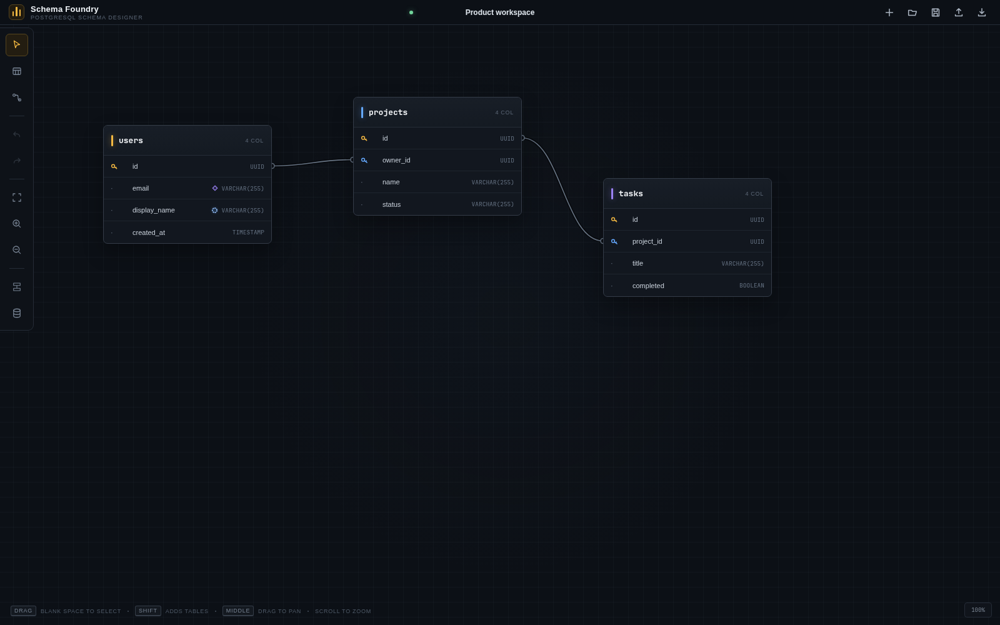
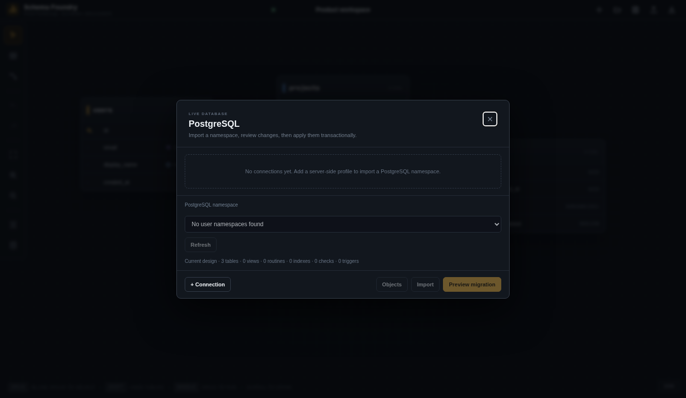

# Schema Foundry

Schema Foundry is a standalone, local browser application for designing PostgreSQL schemas, inspecting live namespaces, previewing schema differences, and applying reviewed migrations. PostgreSQL remains the authority for live database state, while saved JSON schema records retain the editable design and canvas layout.

Schema Foundry has no Tagg, workflow, backlog, or coordinator behavior. It is a generic PostgreSQL schema design and migration tool.

## Try It In One Command

The default trial starts only Schema Foundry. It does not install, start, or contact PostgreSQL. Docker is the only prerequisite, and saved schemas persist across restarts.

Linux or macOS:

```bash
git clone https://github.com/LandMineDevelopment/schema-foundry.git
cd schema-foundry
./start.sh
```

Windows PowerShell with Docker Desktop running in Linux container mode:

```powershell
git clone https://github.com/LandMineDevelopment/schema-foundry.git
Set-Location schema-foundry
powershell -ExecutionPolicy Bypass -File .\start.ps1
```

The launcher builds the image, starts the UI, and opens `http://127.0.0.1:8080/`. Edit the built-in sample, use the disk button to save it, and use the folder button to reopen saved designs. No account, database profile, `.env`, Node.js, or local Python installation is needed.

Without Git, download and extract the GitHub source ZIP, open a terminal in the extracted directory, and run the platform launcher above.

AI-assisted setup instructions are in [`docs/AI_AGENT_SETUP.md`](docs/AI_AGENT_SETUP.md). Give that file and `agent_guide.md` to an AI agent before asking it to operate the project or migrate saved data.

| Goal | Linux or macOS | Windows PowerShell |
| --- | --- | --- |
| Try the UI without PostgreSQL | `./start.sh` | `powershell -ExecutionPolicy Bypass -File .\start.ps1` |
| Connect to Linux host PostgreSQL | `./start.sh local-db` | Not applicable; use UI mode and `host.docker.internal` |
| Start UI with included PostgreSQL | `./start.sh docker-db` | `powershell -ExecutionPolicy Bypass -File .\start.ps1 -Mode docker-db` |

## Optional AI Assistant

The embedded assistant runs in a pinned, containerized OpenCode sidecar. It is not started by default.

```bash
./start.sh ai
./start.sh ai-local-db
./start.sh ai-docker-db
```

Use `ai` for design-only chat, `ai-local-db` for a Linux host PostgreSQL server, or `ai-docker-db` for the included PostgreSQL container. Windows PowerShell supports `-Mode ai` and `-Mode ai-docker-db`; use `ai` with profile host `host.docker.internal` for a Windows host database.

The AI panel discovers providers, subscription/API-key sign-in methods, connected models, and packaged Schema Foundry skills from OpenCode. Working temporary OpenCode free models are available without a key; provider settings also support an optional OpenCode Zen key. Users control whether the model receives metadata, full schema structure, or explicitly approved query results. Raw SQL is always visible, every write requires separate UI confirmation, and migration apply continues through the existing reviewed plan workflow.

See [`docs/AI_ASSISTANT.md`](docs/AI_ASSISTANT.md) for provider sign-in, model selection, data disclosure, tools, skills, confirmations, credential storage, and limitations.

## Screenshots

### Schema Canvas



### PostgreSQL Workflow



## Quick Start: UI Only

This is the simplest way to use Schema Foundry. It starts only the UI and its local API. PostgreSQL is not installed, started, or contacted, and no database profile is required. You can design schemas, save and reopen multiple designs, import SQL files, and export JSON or SQL.

Install Docker Desktop on Windows or macOS, or Docker Engine with the Compose plugin on Linux. On Windows, use Docker Desktop's Linux container mode.

Use the launcher shown above, or run Compose directly:

```bash
git clone https://github.com/LandMineDevelopment/schema-foundry.git
cd schema-foundry
docker compose up --build -d
```

Open `http://127.0.0.1:8080/`. The built-in sample design is immediately editable. Use the disk button in the top toolbar to save, the folder button to reopen a saved design, and the plus button to create another design. Saved designs remain in the `schema-foundry-schemas` Docker volume across container restarts and upgrades.

View startup output with `docker compose logs -f schema-foundry` and stop the application with `docker compose down`. Starting it again with `docker compose up -d` restores saved designs. Do not run `docker compose down --volumes` unless you intend to delete them.

The Compose configuration:

- Publishes the application only on the host loopback interface, not the LAN.
- Runs as an unprivileged user with a read-only container filesystem and dropped capabilities.
- Persists profiles and migration history in `schema-foundry-config`.
- Persists schema JSON records in `schema-foundry-schemas`.
- Does not start PostgreSQL unless the separate PostgreSQL Compose file is explicitly selected.

To use another host port:

```bash
SCHEMA_FOUNDRY_HOST_PORT=8081 docker compose up --build -d
```

On PowerShell, set `$env:SCHEMA_FOUNDRY_HOST_PORT = "8081"` before running `docker compose up --build -d`.

## Quick Start: UI And PostgreSQL

Use the optional Compose file to start Schema Foundry with a private PostgreSQL 17 container. The database port is not published to the host or LAN; only Schema Foundry can reach it on the Compose network.

```bash
./start.sh docker-db
```

On Windows, run `powershell -ExecutionPolicy Bypass -File .\start.ps1 -Mode docker-db`. The equivalent direct Compose command is `docker compose -f compose.yaml -f compose.postgres.yaml up --build -d`.

Open `http://127.0.0.1:8080/`, select the database icon labeled **PostgreSQL sync**, choose **+ Connection**, and enter:

| Field | Local container value |
| --- | --- |
| Name | `Local Docker PostgreSQL` |
| Host | `postgres` |
| Port | `5432` |
| Database | `schema_foundry` |
| User | `schema_foundry` |
| Password | `schema-foundry-local` |
| SSL mode | `disable` |
| Timeout | `10` |

Choose **Save & test**. After it succeeds, select the `public` namespace and use **Import** to load its live schema or **Preview migration** to compare the current design with PostgreSQL.

The default credentials are only for local evaluation. To choose your own before the first database start, copy `.env.example` to `.env`, edit its values, and use those same values in the connection form:

```bash
cp .env.example .env
```

Windows PowerShell:

```powershell
Copy-Item .env.example .env
notepad .env
docker compose -f compose.yaml -f compose.postgres.yaml up --build -d
```

Windows Command Prompt:

```bat
copy .env.example .env
notepad .env
docker compose -f compose.yaml -f compose.postgres.yaml up --build -d
```

PostgreSQL data persists in `schema-foundry-postgres`. Stop this stack with `docker compose -f compose.yaml -f compose.postgres.yaml down`. Adding `--volumes` deletes the PostgreSQL database as well as Schema Foundry profiles and saved designs.

Back up the optional database with PostgreSQL's own tools before migration testing or upgrades:

```bash
docker compose -f compose.yaml -f compose.postgres.yaml exec -T postgres pg_dump -U schema_foundry -d schema_foundry > schema-foundry-postgres.sql
```

If `.env` changes the database or user, substitute those values in the command.

## Connect To PostgreSQL

Open Schema Foundry, choose **PostgreSQL**, create a profile, and enter the database host, port, database name, user, password, SSL mode, and connection timeout. Use **Test connection** before selecting a namespace or introspecting.

Choose the launch mode and profile host according to where PostgreSQL runs:

| PostgreSQL location | Compose files | Profile host |
| --- | --- | --- |
| Linux host, including a server bound only to host loopback | `compose.yaml` + `compose.local-db.yaml` | `127.0.0.1` or `localhost` |
| Windows or macOS Docker Desktop host | `compose.yaml` | `host.docker.internal` |
| Supplied PostgreSQL container | `compose.yaml` + `compose.postgres.yaml` | `postgres` |
| Existing container on the same Docker network | `compose.yaml` | Its service name or network alias |
| Another machine or managed service | `compose.yaml` | Its DNS name or IP address |
| Native Schema Foundry and native PostgreSQL | Not applicable | Usually `127.0.0.1` |

### Linux Host PostgreSQL

Linux containers cannot normally reach a PostgreSQL server listening only on host `127.0.0.1`. The Linux-only override gives Schema Foundry the host network namespace while keeping the UI bound to host loopback:

```bash
./start.sh local-db
```

The equivalent direct Compose command is `docker compose -f compose.yaml -f compose.local-db.yaml up --build -d`.

Use `127.0.0.1` or `localhost` in the profile. This mode also reaches a PostgreSQL Docker container whose port is published on host loopback. Stop it with:

```bash
docker compose -f compose.yaml -f compose.local-db.yaml down
```

The same named config and schema volumes are used in every launch mode, so switching modes does not discard saved designs or profiles.

### Windows And macOS Host PostgreSQL

Start the normal UI stack with `docker compose up --build -d` and use `host.docker.internal` in the profile. Docker Desktop resolves that name to the host. Ensure PostgreSQL accepts the connection and the operating-system firewall permits Docker Desktop.

### Docker PostgreSQL

For the supplied private PostgreSQL container, start `compose.yaml` with `compose.postgres.yaml` as shown in **Quick Start: UI And PostgreSQL**, then use `postgres` in the profile. For an existing PostgreSQL container, attach both containers to the same user-defined network and use the database container's service name or network alias.

Do not expose PostgreSQL broadly just to make container networking work. Prefer the host-network override for Linux loopback, Docker Desktop's host alias, or a private user-defined Docker network.

Use `sslmode=verify-full` with trusted certificates for remote production databases when possible. Use a narrowly privileged PostgreSQL role: inspection needs catalog and target-schema access, while migration apply additionally needs only the DDL privileges required by the reviewed plan.

### Connection Troubleshooting

- In normal bridge mode, do not use `127.0.0.1` for another container or the host. Use `postgres`, another same-network service name, or `host.docker.internal`. In Linux host-network mode, `127.0.0.1` intentionally refers to the Linux host.
- If **Save & test** reports connection refused, confirm the PostgreSQL container is healthy with `docker compose -f compose.yaml -f compose.postgres.yaml ps`.
- If a host PostgreSQL server is unreachable from Docker on Linux, use `compose.local-db.yaml` and confirm PostgreSQL is listening on host loopback. If using bridge networking instead, verify `listen_addresses`, `pg_hba.conf`, the host firewall, and the Docker bridge source address.
- On Windows, confirm Docker Desktop is running in Linux container mode and that `docker compose version` succeeds in PowerShell or Command Prompt.
- If port `8080` is already in use, set `SCHEMA_FOUNDRY_HOST_PORT` to another host port as shown in the UI-only quick start.

## Windows Native Launch

Docker Desktop is recommended on Windows because it provides the same environment as Linux and macOS. Native Windows use requires Python 3.10 or newer.

PowerShell:

```powershell
git clone https://github.com/LandMineDevelopment/schema-foundry.git
Set-Location schema-foundry
py -3 -m venv .venv
.\.venv\Scripts\Activate.ps1
python -m pip install -e .
schema-foundry
```

If PowerShell execution policy prevents activation, use Command Prompt:

```bat
git clone https://github.com/LandMineDevelopment/schema-foundry.git
cd schema-foundry
py -3 -m venv .venv
.venv\Scripts\activate.bat
python -m pip install -e .
schema-foundry
```

Open `http://127.0.0.1:8080/`. Native Windows schema files default to `%USERPROFILE%\.local\share\schema-foundry\schemas`; profiles and migration history default to `%USERPROFILE%\.config\schema-foundry`.

## Linux And macOS Native Launch

Native use requires Python 3.10 or newer. PostgreSQL is optional until a database operation is requested.

```bash
python3 -m venv .venv
source .venv/bin/activate
python3 -m pip install -e .
schema-foundry
```

Open `http://127.0.0.1:8080/` and stop the process with `Ctrl-C`.

For source-tree development without installation:

```bash
python3 -m pip install -r requirements.txt
PYTHONPATH=src python3 -m schema_foundry.server
```

## Configuration

Schema Foundry reads these environment variables at startup:

| Variable | Default | Purpose |
| --- | --- | --- |
| `SCHEMA_FOUNDRY_HOST` | `127.0.0.1` | HTTP bind address |
| `SCHEMA_FOUNDRY_PORT` | `8080` | HTTP port, from 1 through 65535 |
| `SCHEMA_FOUNDRY_CONFIG_DIR` | `~/.config/schema-foundry` | PostgreSQL profiles and migration history |
| `SCHEMA_FOUNDRY_SCHEMA_DIR` | `~/.local/share/schema-foundry/schemas` | Saved schema JSON records |
| `SCHEMA_FOUNDRY_BEHIND_LOOPBACK_PROXY` | `0` | Trust a loopback-only container or proxy boundary; accepts only `0` or `1` |
| `SCHEMA_FOUNDRY_OPENCODE_URL` | empty | Fixed OpenCode server URL; empty disables embedded AI |
| `SCHEMA_FOUNDRY_OPENCODE_USERNAME` | `opencode` | OpenCode Basic-auth username |
| `SCHEMA_FOUNDRY_OPENCODE_PASSWORD` | empty | OpenCode Basic-auth password; AI launchers generate one |
| `SCHEMA_FOUNDRY_OPENCODE_TIMEOUT` | `45` | OpenCode request timeout from 1 through 300 seconds; failed chat abort adds at most 5 seconds |

The default schema data directory is therefore `~/.local/share/schema-foundry/schemas`. To use a project-specific or external schema directory:

```bash
SCHEMA_FOUNDRY_SCHEMA_DIR=/absolute/path/to/schemas schema-foundry
```

The PostgreSQL API is designed for local browser use and requires both a local origin and the per-process session token. Keep the default loopback host unless you have separately provided an appropriate secure access boundary. `SCHEMA_FOUNDRY_BEHIND_LOOPBACK_PROXY=1` relaxes only the source-IP check needed after Docker port forwarding; it still requires a localhost host and origin. Do not enable it unless the forwarding port is bound exclusively to host loopback as it is in `compose.yaml`.

## Standalone Runtime

In non-AI modes, Schema Foundry runs as one Python process and serves all browser HTML, CSS, JavaScript, schema storage, and API routes itself. It has no CDN assets, telemetry, external HTTP APIs, or subprocess helpers. Browser connections are restricted to the same Schema Foundry origin by Content Security Policy. The only application-initiated connection outside that origin is a PostgreSQL connection explicitly selected from a saved profile; offline schema design does not require PostgreSQL to be available.

AI modes additionally start the pinned OpenCode sidecar. The browser still uses only Schema Foundry's same-origin API, while the backend proxies a narrow allowlist of OpenCode operations. OpenCode contacts only the model provider selected and authenticated by the user. UI-only operation remains available when OpenCode is absent or offline.

Configured storage paths are expanded and resolved to absolute paths at startup, so runtime data does not depend on the directory from which the process was launched. Psycopg is the only third-party runtime package. Node.js is used by development checks and tests only, not by the running application.

## Docker Data And Upgrades

Rebuild after pulling a new version:

```bash
git pull
docker compose up --build -d
```

`docker compose down` removes the container and network but retains both named volumes. `docker compose down --volumes` permanently removes saved schemas, profiles, passwords, and migration history; do not use it unless that deletion is intentional.

Back up both volumes before upgrades or migration work. One portable approach is to stop the service and archive each volume with a temporary container:

```bash
docker compose stop schema-foundry
docker run --rm -v schema_foundry_schema-foundry-config:/source:ro -v "$PWD":/backup alpine tar -czf /backup/schema-foundry-config.tgz -C /source .
docker run --rm -v schema_foundry_schema-foundry-schemas:/source:ro -v "$PWD":/backup alpine tar -czf /backup/schema-foundry-schemas.tgz -C /source .
docker compose start schema-foundry
```

The volume prefix normally comes from the project directory name. Confirm actual names with `docker volume ls` before backup or restore. On PowerShell, replace `"$PWD"` with an absolute host path accepted by Docker Desktop.

## API Summary

- `GET /api/session`: obtain the current local session token used by PostgreSQL API requests.
- `GET /api/schemas`: list saved schema records.
- `PUT /api/schemas/{schemaId}`: create or update a schema record with revision and layout-conflict checks.
- `DELETE /api/schemas/{schemaId}`: delete a saved schema record.
- `GET|POST /api/postgres/profiles` and `PUT|DELETE /api/postgres/profiles/{profileId}`: list, create, update, or delete connection profiles.
- `POST /api/postgres/profiles/{profileId}/test`: test a PostgreSQL connection.
- `GET /api/postgres/profiles/{profileId}/namespaces`: list user namespaces.
- `POST /api/postgres/profiles/{profileId}/introspect`: introspect one namespace.
- `GET /api/postgres/profiles/{profileId}/fingerprint`: read current catalog identity and object counts.
- `GET /api/postgres/profiles/{profileId}/data`: preview bounded table data.
- `POST /api/postgres/profiles/{profileId}/sql`: execute one bounded, read-only query.
- `POST /api/postgres/profiles/{profileId}/preview`: create an expiring migration plan from a saved design and the current catalog.
- `POST /api/postgres/profiles/{profileId}/plans/{planId}/apply`: apply a still-current plan transactionally.
- `GET /api/postgres/history`: list local migration history.

PostgreSQL endpoints require the token returned by `/api/session` in the `X-Schema-Foundry-Token` header. Schema saves use revision checks and the layout protocol headers managed by the browser application.

## Profiles And Passwords

Profiles are stored in `postgres_profiles.json` under `SCHEMA_FOUNDRY_CONFIG_DIR`. Passwords are stored in that local JSON file, not in an operating-system keyring. The configuration directory is set to mode `0700`, and profile and migration-history files are set to mode `0600` where supported. Profile API responses redact passwords.

Protect the configuration directory, do not commit it, and use a PostgreSQL role with only the privileges needed for inspection or the intended migration. An empty password during profile update preserves the existing stored password.

## Migration Safety

1. Select the exact profile, database, and namespace intended for the change.
2. Introspect first and preserve the existing saved layout when refreshing semantic schema content.
3. Preview every migration and review every SQL step and warning.
4. Enable destructive planning only when destructive changes are intentional, then provide the separate destructive confirmation at apply time.
5. Re-preview if the design, connection profile, or live catalog changes. Apply rejects expired plans, changed profiles, and stale catalog fingerprints.
6. Back up important data before structural changes and test migrations against a disposable or staging database first.

Apply takes a namespace-scoped PostgreSQL advisory transaction lock, sets lock and statement timeouts, rechecks the live fingerprint, and executes all planned steps in one transaction. A failed step rolls the transaction back. Partitioned tables may be introspected but require manual migrations.

Treat saved canvas layout as user-owned data. Before scripts or tools rewrite schema JSON, follow `.opencode/skills/preserve-foundry-layout/SKILL.md`, including snapshots and parsed-layout equality checks.

## Starter Schema

`examples/schema_starter.json` is a starter design that can be copied into the configured schema directory. Use a new ID and filename if retaining the original starter alongside the new design.

## Tests

Development checks require Python 3.10 or newer and Node.js. Node.js is not needed in the application container or for native runtime use.

```bash
python3 -m unittest discover -s tests
python3 -m compileall -q src
node --check src/schema_foundry/web/app.js
for test_file in tests/test_*.js; do node "$test_file" || exit 1; done
git diff --check
docker compose build
```

Database integration testing should use a disposable PostgreSQL database or rollback-safe fixtures. Confirm both zero unexpected migration steps for synchronized schemas and unchanged parsed layout data after generated schema refreshes.

## License

Schema Foundry is released under the permissive [MIT License](LICENSE). It may be used, copied, modified, merged, published, distributed, sublicensed, and sold, provided the copyright and license notice are retained. The software is provided "as is," without warranty, and the license disclaims author and copyright-holder liability to the extent permitted by applicable law.
